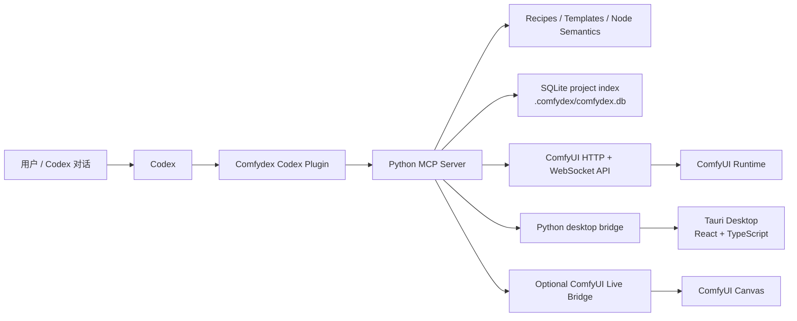

# Comfydex

Comfydex 是一个面向 Codex 的 ComfyUI 本地开发与自动化插件。它让 Codex 不只是“知道有一个 ComfyUI 服务”，而是能理解工作流 JSON、识别节点语义、生成可读的 UI workflow、检查本机模型和节点能力、提交运行、等待队列、收集输出，并把这些过程记录到一个可检索的本地项目索引中。

Comfydex 安装在 Codex 侧；ComfyUI 仍然是图形工作流编辑器和实际运行时。两者通过 ComfyUI HTTP API、WebSocket API，以及可选的 ComfyUI Live Bridge 连接。

Current version: `2.0.0`

## 目录

- [项目定位](#项目定位)
- [核心能力](#核心能力)
- [技术架构](#技术架构)
- [运行模型](#运行模型)
- [工作流生成能力](#工作流生成能力)
- [桌面端](#桌面端)
- [本地数据与安全边界](#本地数据与安全边界)
- [安装与配置](#安装与配置)
- [常用命令](#常用命令)
- [项目结构](#项目结构)
- [开发与验证](#开发与验证)

## 项目定位

ComfyUI 的优势是低层级、可组合、可视化的图工作流；问题是节点、模型、插件和运行记录很容易散落在多个目录和界面里。Comfydex 的目标是在 Codex 与 ComfyUI 之间补上一层可审计的工作流控制面：

- Codex 负责理解用户意图、解释计划、调用工具和修复失败。
- Comfydex 负责把意图变成结构化计划、工作流文件、能力检查、运行记录和输出资产索引。
- ComfyUI 负责最终的节点执行、队列、历史记录和图形编辑。

这使用户可以用自然语言描述常见工作流，例如“用 Z image 模型生成一张产品图”“把这张图的背景换成摄影棚背景”“根据姿势图生成角色图”，然后由 Codex 通过 Comfydex 生成可检查、可保存、可推送到 ComfyUI 画布的工作流。

## 核心能力

### 自然语言到 ComfyUI 工作流

Comfydex 内置 Scenario Recipe Registry，把自然语言场景映射到可验证的模板和参数需求。当前一等场景包括：

- text-to-image
- image-to-image
- portrait
- character consistency
- product image
- ControlNet
- inpainting
- upscaling
- background replacement

相关工具包括 `comfy_suggest_workflow_recipes`、`comfy_resolve_recipe_capabilities`、`comfy_plan_workflow_generation`、`comfy_generate_workflow`、`comfy_evaluate_submit_policy`、`comfy_build_ui_workflow`、`comfy_generate_ui_workflow`、`comfy_generate_push_ui_workflow` 和 `comfy_read_ui_graph_history`。配方路径支持 recipe-aware capability checks，因此 Codex 能在生成前说明 recipe candidates、selected recipe id、本地模型和节点缺口。

### Ordinary User Guidance

Ordinary User Guidance 是面向普通 ComfyUI 用户的解释层。它把 `quality_preset`、`aspect_ratio`、`style_preset`、`user_guidance`、`resolved_defaults`、`canvas_replacement` 和 `output_summary` 这些技术字段整理成可读的计划摘要、缺口说明和下一步动作。

### 可读 UI workflow 生成

UI Graph Builder 会把生成计划转换为 ComfyUI 可打开的 generated UI workflow。生成的图包含 stable node ids、可读节点标题、布局信息、链接信息和 `extra.comfydex` 来源元数据。它适合在 ComfyUI 中继续检查和编辑，而不是让用户面对一段难以理解的原始 JSON。

### Live Bridge 画布推送

可选的 Live Bridge 是一个 ComfyUI 侧 custom node / frontend 扩展组合。安装后，Comfydex 可以把生成的 UI workflow 直接推送到打开的 ComfyUI 画布。Desktop 和 MCP 工具都能检查 Live Bridge 状态，包括 Ready、Restart required、Refresh required、Unsaved canvas，以及 Reload client / Reload backend 操作。

### 能力检查与安装计划

Capability Resolver 会把计划需要的节点、模型、参数与当前 ComfyUI `object_info`、model inventory、node inventory 做对比。缺少模型或节点时，Comfydex 只生成 conservative install plan，不做 no silent downloads，不做 no automatic downloads，也不做 no automatic custom node installation。用户确认或拒绝后，可以写入 audit log，并在 desktop Install Plan 面板里查看。

相关工具包括 `comfy_model_inventory`、`comfy_resolve_capabilities`、`comfy_create_install_plan`、`comfy_record_install_audit` 和 `comfy_read_install_audit`。

### 运行、输出与修复闭环

Comfydex 支持把 API prompt 提交到 ComfyUI，等待 WebSocket 事件或 HTTP fallback，读取 `/history`，抓取或登记输出文件，并把运行记录持久化到本地。失败时，Execution And Repair Loop 会生成 `failure_class`、`repair_plan`、可执行或需要确认的修复动作，并通过 `comfy_plan_run_repair`、`comfy_retry_run_repair`、`comfy_read_repair_history` 暴露给 Codex 和桌面端。

低风险的一次性生成可以使用 `comfy_generate_run_fetch`：它会生成、保存、提交、等待、fetch_outputs、重建 project index，并返回 `output_summary`。如果遇到 `object_info_unavailable`、覆盖文件或其他中风险状态，必须通过 `confirm_risky_actions` 明确确认。

### 资产库与项目索引

Comfydex 维护 workspace-local project index，默认数据库路径为 `.comfydex/comfydex.db`。索引包含 workflows、runs、outputs、assets、batches 和可恢复的索引错误。Asset library 支持 asset gallery、搜索、标签、评分、收藏、sidecar、比较、报告和 safe cleanup UI。

相关工具包括 `comfy_project_status`、`comfy_reindex_project`、`comfy_reindex_assets`、`comfy_search_assets`、`comfy_update_asset_metadata`、`comfy_write_asset_sidecars`、`comfy_plan_asset_cleanup`、`comfy_export_asset_library_report` 和 `comfy_compare_assets`。

### 自定义节点开发辅助

Comfydex 可以在工作区内辅助开发 custom node：生成示例、验证映射、检查导入、运行契约测试、生成修复建议。相关工具包括 `comfy_generate_node_examples`、`comfy_run_node_contract_tests` 和 `comfy_custom_node_repair_guidance`。

### 节点语义注册表

Node Semantic Registry 是 Comfydex 对 ComfyUI 常见节点的手写知识库。它解释节点用途、输入输出、参数策略、上下游连接、失败模式和修复建议，并用 live `object_info` 做安装状态校验。已覆盖的常见节点包括 `CheckpointLoaderSimple`、`KSampler`、LoRA、ControlNet、upscale 和 inpaint 路径。

相关工具包括 `comfy_list_node_semantics`、`comfy_explain_node_semantics`、`comfy_search_node_semantics` 和 `comfy_validate_node_semantics`。

Unknown nodes are not treated as first-class supported nodes.

## 技术架构



主要技术栈：

| 层 | 技术 | 职责 |
| --- | --- | --- |
| Codex 插件 | `.codex-plugin/plugin.json`、Skills、MCP 配置 | 让 Codex 发现 Comfydex 的工具、能力说明和默认提示 |
| MCP 服务 | Python 3.11+、FastMCP、httpx、websockets | 暴露 `comfy_*` 工具，管理配置、工作流、运行、输出、索引和能力检查 |
| 工作流知识层 | `templates.py`、`recipes.py`、`node_semantics.py`、`generation.py` | 从意图到模板、配方、参数、语义覆盖和安全提交策略 |
| 本地数据层 | SQLite、JSON records、workspace-local files | 保存 project index、run records、asset sidecars、repair history、install audit |
| 桌面端 | `desktop/`、Tauri v2、React、TypeScript、Vite、Rust | 提供 Windows-first local workbench，通过 Python desktop bridge 读取同一套项目数据 |
| ComfyUI 运行时 | HTTP API、WebSocket、可选 Live Bridge | 负责节点执行、队列、历史、输出和画布 |

## 运行模型

Comfydex 把一个自然语言生成请求拆成几个可检查步骤：

1. 解析意图和参数。
2. 使用 Scenario Recipe Registry 选择 recipe candidates 和 selected recipe id。
3. 应用 `quality_preset`、`aspect_ratio`、`style_preset` 等普通用户预设，生成 `resolved_defaults` 和 `user_guidance`。
4. 通过 Capability Resolver 检查模型、节点和本地安装状态。
5. 生成 API prompt 或 UI workflow。
6. 使用验证结果和 `comfy_evaluate_submit_policy` 判定 `allowed`、`requires_confirmation` 或 `blocked`。
7. 提交运行、等待队列、fetch_outputs、记录 run.json 和输出资产。
8. 如失败，进入 Execution And Repair Loop。

## 工作流生成能力

Comfydex 支持两类输出：

- API prompt JSON：提交给 ComfyUI `/prompt` 前必须是 validated API prompt JSON。
- UI workflow：给 ComfyUI 可视化编辑器打开和检查的图形工作流，可以通过 Live Bridge push 到桌面画布。

典型工具路径：

```text
comfy_suggest_workflow_recipes
comfy_plan_workflow_generation
comfy_resolve_recipe_capabilities
comfy_build_ui_workflow
comfy_generate_push_ui_workflow
comfy_generate_workflow
comfy_generate_run_fetch
```

2.0 Readiness Gate 用 `comfy_list_20_scenarios` 和 `comfy_20_readiness_report` 检查所有一等场景是否 ready。当前 `2.0.0` 状态为 `ready_for_2_0`。

## 桌面端

`desktop/` 是一个 Windows-first Tauri desktop app shell，不替代 ComfyUI 图编辑器，也不替代 Codex 推理。它是本地项目工作台，主要用于查看和确认：

- project status、workflow 列表、run 列表、assets；
- Gallery And Batch UI，包括 asset gallery、比较、报告、safe cleanup UI、batch task view；
- Generated Graphs、generated UI workflow history、Live Bridge push 状态；
- Runs repair panel，包括 `plan_run_repair`、`retry_run_repair`、`read_repair_history`；
- desktop Install Plan、audit log、2.0 Readiness Gate；
- 普通用户摘要，包括 `canvas_replacement`、`output_summary` 和资产摘要。

桌面端通过 Python desktop bridge 调用同一套 Python 逻辑，因此它显示的数据与 MCP 工具共享来源。

## 本地数据与安全边界

默认数据路径：

```text
workflows/
runs/
.comfydex/comfydex.db
```

安全约束：

- 默认 ComfyUI 地址是 `http://127.0.0.1:8188`。
- 远程 ComfyUI 必须显式配置。
- header 值会在配置读取时被隐藏。
- workflow 写入限制在配置的 workflows 目录下。
- 输出下载限制在对应 run 的 outputs 目录下。
- cleanup 默认 dry-run，删除需要确认。
- install plan 只给出人工动作，不下载模型、不安装 custom node。
- capability 和 recipe 检查不会静默修改 ComfyUI。
- path traversal、symlink/reparse redirection 等路径风险会被拒绝。

## 安装与配置

本仓库按本地 Codex 插件结构组织。开发机上常见路径是：

```text
C:/Users/Drew/plugins/comfydex
```

安装 Python 包：

```powershell
python -m pip install -e ".[dev]"
```

Windows 本地安装辅助脚本：

```powershell
powershell -ExecutionPolicy Bypass -File scripts/install_windows.ps1
```

ComfyUI 连接配置文件为：

```text
comfydex.config.json
```

默认配置：

```json
{
  "base_url": "http://127.0.0.1:8188",
  "workflows_dir": "./workflows",
  "runs_dir": "./runs",
  "headers": {},
  "request_timeout_seconds": 30,
  "websocket_timeout_seconds": 600
}
```

远程 ComfyUI 示例：

```json
{
  "base_url": "https://comfy.example.com",
  "headers": {
    "Authorization": "Bearer example-token"
  }
}
```

## 常用命令

检查 ComfyUI 连接：

```powershell
python scripts/smoke_check.py
```

验证插件清单：

```powershell
python scripts/validate_plugin.py
```

验证发布包一致性：

```powershell
python scripts/validate_release_package.py
```

运行 Python 测试：

```powershell
python -m pytest -q
```

验证桌面端：

```powershell
npm --prefix desktop run typecheck
npm --prefix desktop run build
cargo check --manifest-path desktop\src-tauri\Cargo.toml
```

安装或更新 Live Bridge 后验证：

```powershell
pwsh -NoProfile -ExecutionPolicy Bypass -File scripts\verify_live_bridge.ps1 -BaseUrl "http://127.0.0.1:8188" -SkipPush
```

## 主要工具分组

| 分组 | 工具 |
| --- | --- |
| 项目索引 | `comfy_project_status`, `comfy_reindex_project` |
| 工作流生成 | `comfy_plan_workflow_generation`, `comfy_generate_workflow`, `comfy_evaluate_submit_policy`, `comfy_generate_run_fetch` |
| UI Graph Builder | `comfy_build_ui_workflow`, `comfy_generate_ui_workflow`, `comfy_generate_push_ui_workflow`, `comfy_read_ui_graph_history` |
| Recipe | `comfy_suggest_workflow_recipes`, `comfy_resolve_recipe_capabilities` |
| Capability Resolver | `comfy_model_inventory`, `comfy_resolve_capabilities`, `comfy_create_install_plan`, `comfy_record_install_audit` |
| Asset library | `comfy_reindex_assets`, `comfy_search_assets`, `comfy_update_asset_metadata`, `comfy_write_asset_sidecars`, `comfy_plan_asset_cleanup`, `comfy_export_asset_library_report`, `comfy_compare_assets` |
| Node Semantic Registry | `comfy_list_node_semantics`, `comfy_explain_node_semantics`, `comfy_search_node_semantics`, `comfy_validate_node_semantics` |
| Repair | `comfy_plan_run_repair`, `comfy_retry_run_repair`, `comfy_read_repair_history` |
| Custom node | `comfy_generate_node_examples`, `comfy_run_node_contract_tests`, `comfy_custom_node_repair_guidance` |
| User guidance | `comfy_list_generation_presets`, `comfy_summarize_assets` |

## 项目结构

```text
.
├── .codex-plugin/              # Codex 插件清单
├── .mcp.json                   # MCP server 启动配置
├── custom_nodes/               # 可选 ComfyUI Live Bridge
├── desktop/                    # Tauri + React + TypeScript 桌面端
├── docs/                       # 使用、安装、发布和安全文档
├── examples/                   # 示例工作流和报告
├── scripts/                    # 安装、验证、Live Bridge 和 smoke check 脚本
├── skills/                     # Codex Skills
├── src/comfydex_mcp/           # Python MCP 服务和核心逻辑
└── tests/                      # Python 测试
```

`src/comfydex_mcp/` 中的关键模块：

| 模块 | 职责 |
| --- | --- |
| `server.py` | MCP 工具注册与路由 |
| `comfy_client.py` / `ws.py` | ComfyUI HTTP 与 WebSocket 通信 |
| `config.py` / `paths.py` | 配置、脱敏和路径安全 |
| `core/` | SQLite project index、schema migrations、project status |
| `templates.py` / `recipes.py` | 工作流模板和 Scenario Recipe Registry |
| `generation.py` / `builder.py` | 生成计划、参数修复、API prompt 构建 |
| `ui_graphs.py` | UI Graph Builder 与 generated UI workflow history |
| `capabilities.py` | Capability Resolver、model inventory、install plan |
| `node_semantics.py` | Node Semantic Registry |
| `runs.py` / `outputs.py` / `assets.py` | 运行记录、输出、资产库 |
| `repairs.py` / `diagnostics.py` | 失败分类、repair_plan、运行诊断 |
| `desktop_bridge.py` | 桌面端 JSON bridge |

## 开发与验证

推荐在提交前运行：

```powershell
python -m pytest -q
python scripts/validate_plugin.py
python scripts/validate_release_package.py
npm --prefix desktop run typecheck
npm --prefix desktop run build
cargo check --manifest-path desktop\src-tauri\Cargo.toml
```

如果修改 Live Bridge，还应运行：

```powershell
pwsh -NoProfile -ExecutionPolicy Bypass -File scripts\verify_live_bridge.ps1 -BaseUrl "http://127.0.0.1:8188" -SkipPush
```

## 相关文档

- `docs/usage/conversational-workflow-system.md`
- `docs/usage/2.0-readiness-gate.md`
- `docs/usage/workflow-generation.md`
- `docs/usage/ui-graph-builder.md`
- `docs/usage/scenario-recipes.md`
- `docs/usage/capability-resolver.md`
- `docs/usage/node-semantic-registry.md`
- `docs/usage/execution-repair-loop.md`
- `docs/usage/asset-library.md`
- `docs/usage/desktop-app.md`
- `docs/usage/live-bridge.md`
- `docs/release/windows-install.md`

## 校验兼容标记

README 不展开完整发布历史；详细历史保存在 `docs/release/`。以下短语保留给现有自动化测试和发布校验识别能力边界：`0.8.0`、`0.9.0`、`1.0.0`、`Gallery And Batch UI`、`End-To-End Automation And Hardening`、`Usable Developer Release`、`confirm_risky_actions`、`validate_release_package.py`、`scripts/install_windows.ps1`、`asset gallery`、`batch task view`、`safe cleanup UI`、`desktop/`、`Tauri`、`Python desktop bridge`、`UI workflow`、`custom node`、`batch`、`project index`、`workflow generation`。

## License

MIT
